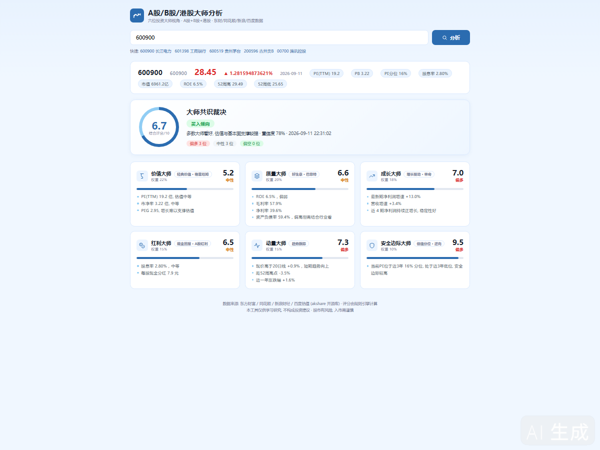
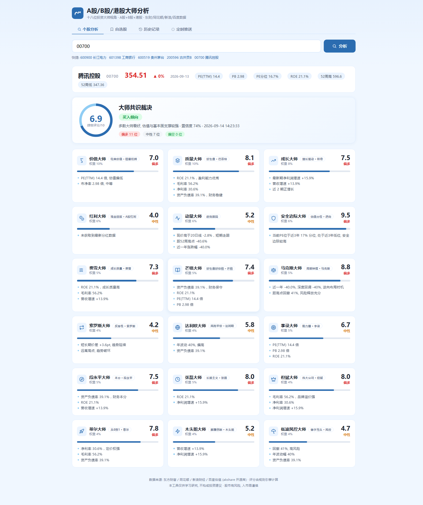
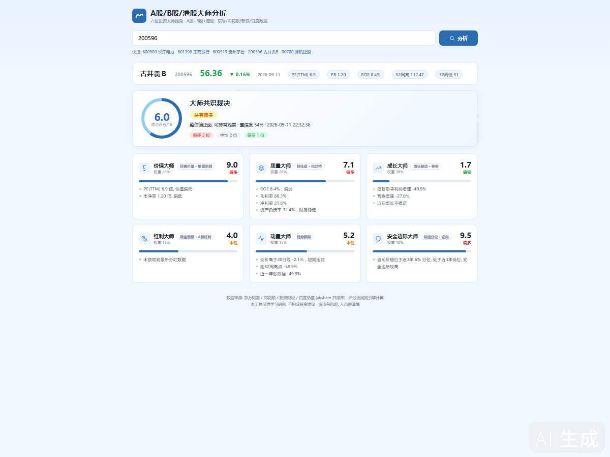
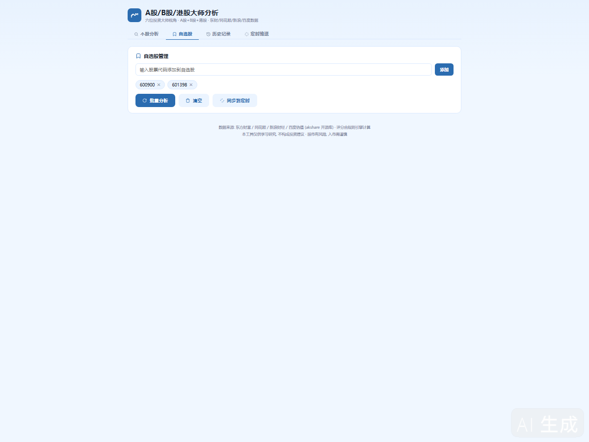
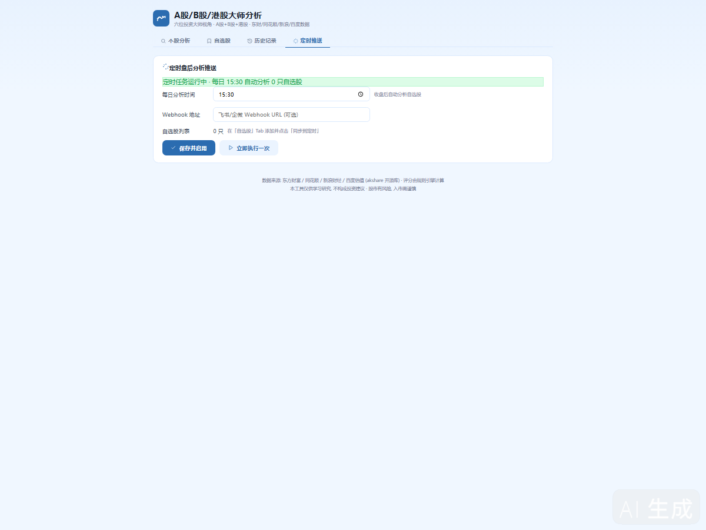

---
AIGC:
  ContentProducer: '001191110102MAD55U9H0F10002'
  ContentPropagator: '001191110102MAD55U9H0F10002'
  Label: '1'
  ProduceID: '1f812c3b-d85f-42c6-b690-42cc7f875481'
  PropagateID: '1f812c3b-d85f-42c6-b690-42cc7f875481'
  ReservedCode1: '8b5b3090-32e5-4f53-8b73-73d317377bc4'
  ReservedCode2: '8b5b3090-32e5-4f53-8b73-73d317377bc4'
---

<div align="center">

# StockMasters

**六位投资大师视角 · A股/B股/港股多市场投资分析系统**

Six Investment Masters · Multi-Market Stock Analysis for A-Shares, B-Shares & Hong Kong Stocks

[](https://www.python.org/)
[](https://akshare.akfamily.xyz/)
[](LICENSE)
[](#)

</div>

---

## 中文介绍

输入一个股票代码，六位投资大师从各自视角独立打分，形成加权共识裁决——买入、持有还是卖出。

### 界面截图

#### A股分析 — 长江电力（600900）



#### 港股分析 — 腾讯控股（00700）



#### B股分析 — 古井贡B（200596）



#### 自选股批量分析



#### 历史记录



#### 定时推送设置


### 核心特点

- **三大市场全覆盖**：A股（沪深600/000/300/688）、B股（深B 200/沪B 900）、港股（1-5位代码），自动识别市场类型
- **六位投资大师独立评分**：价值大师（格雷厄姆）、质量大师（巴菲特）、成长大师（林奇）、红利大师、动量大师、安全边际大师——每位大师用不同指标体系打分，互不干扰
- **加权共识裁决**：六位大师按权重综合，输出 0-10 分评分 + 买入/持有/卖出信号 + 置信度 + 多空分布
- **自选股批量分析**：添加自选股后一键批量分析，结果以表格展示，点击即可跳转个股详情
- **分析历史记录**：每次分析自动存档，支持按代码/信号/日期筛选，点击记录可重新查看
- **定时盘后自动推送**：设置每日收盘时间自动分析自选股，通过飞书/企微 Webhook 推送结果
- **国内数据源直连**：基于 akshare 开源库，数据来自东方财富、同花顺、新浪财经、百度估值，无需翻墙，受限内网环境可用
- **零外部依赖前端**：纯原生 HTML/CSS/JS，白底淡蓝风格，无 React/Vue/jQuery，双击即运行
- **一键启停**：BAT 脚本启动/停止，无需命令行操作

### 六位大师评分体系

| 大师 | 流派 | 权重 | 核心指标 |
|------|------|:---:|----------|
| 价值大师 | 经典价值 · 格雷厄姆 | 22% | PE、PB、PEG |
| 质量大师 | 好生意 · 巴菲特 | 20% | ROE、毛利率、净利率、资产负债率 |
| 成长大师 | 增长驱动 · 林奇 | 18% | 净利润增速、营收增速、增长持续性 |
| 红利大师 | 现金回报 | 15% | 股息率、每股分红 |
| 动量大师 | 趋势跟踪 | 15% | 20日线偏离、52周高低、年度涨跌 |
| 安全边际大师 | 估值分位 · 逆向 | 10% | PE/价格近3年历史分位 |

### 快速开始

```bash
git clone https://github.com/cctvgh/StockMasters.git
cd StockMasters
python -m venv venv
venv\Scripts\python.exe -m pip install akshare -i https://pypi.tuna.tsinghua.edu.cn/simple

# 双击启动大师分析.bat，或命令行启动：
venv\Scripts\python.exe server.py
```

浏览器访问 http://localhost:8020 ，输入股票代码即可分析。

### 制作经过

本项目诞生于一个真实的受限网络办公环境——中国电信内网，受天融信防火墙和深信服零信任 VPN 管控，无法访问 Yahoo Finance、SEC EDGAR 等境外金融数据源。

最初尝试安装开源项目 [Augur](https://github.com/BruceLanLan/augur)（一款基于 18 位虚拟投资大师的多智能体分析系统），安装成功后发现其核心数据源 Yahoo Finance 在中国大陆被全面封锁，分析功能无法使用。

转而自研一套基于国内数据源的替代方案，过程中攻克了多个工程难题：

1. **防火墙数据源降级**：东财 push2his/push2 子域被防火墙拦截，发现 datacenter.eastmoney.com 始终可达，改用 `stock_value_em` 接口同时获取估值+价格历史
2. **港股数据反推**：港股行情接口被墙，用百度估值 PE(TTM) 历史 × 东财 EPS_TTM 反推价格序列
3. **B股估值反算**：东财B股快照被墙，改用新浪 K 线 + 同花顺财务数据，通过 价格÷EPS 反算 PE、价格÷BPS 反算 PB
4. **安全边际代理**：B 股无 PE 历史序列，用价格近3年分位替代 PE 分位作为安全边际指标
5. **全局 UA 注入**：akshare 内部 requests 未设 User-Agent 被风控拒绝，monkey-patch `Session.request` 全局注入
6. **指数退避重试**：数据源偶发断连，封装 `with_retry` 退避重试机制

最终成果：一个在受限内网下可用的、覆盖 A 股/B 股/港股三大市场的多大师投资分析系统。

> 完整的系统架构、评分体系、数据通道与 API 文档见 **[docs/architecture.md](docs/architecture.md)**（含 Mermaid 流程图）。

---

## English

Enter a stock code, and six investment masters analyze it from their respective perspectives, forming a weighted consensus verdict — Buy, Hold, or Sell.

### Key Features

- **Three Markets Covered**: A-Shares (Shanghai/Shenzhen 600/000/300/688), B-Shares (Shenzhen 200 / Shanghai 900), Hong Kong Stocks (1-5 digit codes) — auto-detected
- **Six Master Agents**: Value (Graham), Quality (Buffett), Growth (Lynch), Dividend, Momentum, and Margin of Safety — each scores independently using distinct indicator frameworks
- **Weighted Consensus**: Masters' scores combine into a 0-10 rating with Buy/Hold/Sell signal, confidence level, and bull/neutral/bear distribution
- **Watchlist Batch Analysis**: Add stocks to watchlist and analyze all at once, results in sortable table, click to drill into details
- **Analysis History**: Every analysis auto-archived, filterable by code/signal/date, click to re-view
- **Scheduled Post-Close Push**: Set daily auto-analysis time, push results to Feishu/WeCom Webhook
- **Domestic Data Sources**: Built on akshare (open-source), data from East Money, 10jqka (THS), Sina Finance, and Baidu Valuation — works behind corporate firewalls without VPN
- **Zero-Dependency Frontend**: Pure HTML/CSS/JS, no React/Vue/jQuery, clean blue-on-white design, runs by double-clicking
- **One-Click Start/Stop**: BAT scripts included, no command-line knowledge required

### How It Works

```
Stock Code → Market Detection → Data Fetch (akshare) → 6 Masters Score → Weighted Consensus → Dashboard
```

Each master evaluates the stock using its own indicator set:

| Master | School | Weight | Key Metrics |
|--------|--------|:---:|-------------|
| Value | Graham | 22% | PE, PB, PEG |
| Quality | Buffett | 20% | ROE, Gross/Net Margin, Debt Ratio |
| Growth | Lynch | 18% | Profit/Revenue Growth, Growth Streak |
| Dividend | Income | 15% | Dividend Yield, Per-Share Dividend |
| Momentum | Trend | 15% | 20-Day Deviation, 52W High/Low, YoY Change |
| Margin of Safety | Contrarian | 10% | 3-Year PE/Price Percentile |

### Data Source Strategy

| Market | Price Data | Valuation | Financials |
|--------|-----------|-----------|------------|
| A-Shares | East Money datacenter | East Money `stock_value_em` | THS Financial Abstract |
| B-Shares | Sina `stock_zh_b_daily` | Sina spot + reverse-calc from financials | THS Financial Abstract |
| HK Stocks | Baidu PE history × EPS reverse-derive | Baidu Valuation PE/PB | East Money HK Financials |

### Quick Start

```bash
git clone https://github.com/cctvgh/StockMasters.git
cd StockMasters
python -m venv venv
venv\Scripts\python.exe -m pip install akshare

# Launch:
venv\Scripts\python.exe server.py
# Open http://localhost:8020
```

### Development Story

This project was born in a real restricted network environment — China Telecom's corporate intranet, behind Topsec firewall and Sangfor Zero-Trust VPN, with no access to Yahoo Finance, SEC EDGAR, or other overseas financial data sources.

The journey began with attempting to install [Augur](https://github.com/BruceLanLan/augur), an open-source multi-agent investment analysis system with 18 virtual investor personas. Installation succeeded, but its core data source (Yahoo Finance) is entirely blocked in mainland China, rendering analysis non-functional.

The pivot: build a domestic-data-source alternative. Key engineering challenges solved along the way:

1. **Firewall Fallback**: East Money's `push2his`/`push2` subdomains are firewall-blocked, but `datacenter.eastmoney.com` remains reachable — switched to `stock_value_em` for combined valuation + price history
2. **HK Price Derivation**: HK stock quote APIs blocked — reverse-derived price series from Baidu PE(TTM) history × East Money EPS_TTM
3. **B-Share Valuation Reverse-Calc**: East Money B-share snapshot blocked — used Sina daily K-line + THS financials, reverse-calculating PE = Price ÷ EPS and PB = Price ÷ BPS
4. **Margin of Safety Proxy**: B-shares lack historical PE series — substituted 3-year price percentile as the margin-of-safety indicator
5. **Global UA Injection**: akshare's internal requests lack User-Agent and get rate-limited — monkey-patched `Session.request` for global UA injection
6. **Exponential Backoff Retry**: Data sources occasionally drop — wrapped all calls in `with_retry` with exponential backoff

The result: a multi-master investment analysis system that works behind restrictive corporate firewalls, covering A-Shares, B-Shares, and Hong Kong Stocks.

---

## 技术栈 / Tech Stack

| Layer | Technology |
|-------|-----------|
| Backend | Python stdlib `http.server` + akshare + pandas |
| Frontend | Native HTML / CSS / JS (zero dependencies) |
| Data Source | akshare (East Money, THS, Sina, Baidu) |
| Scoring | Rule-based engine (no LLM required) |
| Deployment | BAT scripts, localhost, data stays on-device |

## 项目结构 / Project Structure

```
StockMasters/
├── server.py              # 后端：数据引擎 + 评分引擎 + HTTP服务 + 历史记录 + 定时任务
├── index.html             # 前端：原生HTML单页应用（4个Tab：个股/自选/历史/定时）
├── 启动大师分析.bat        # Windows一键启动
├── 停止大师分析.bat        # Windows一键停止
├── docs/
│   ├── architecture.md          # 系统架构详解（含Mermaid流程图）
│   ├── screenshot-astock.png      # A股分析截图
│   ├── screenshot-hkstock.png   # 港股分析截图
│   ├── screenshot-bstock.png    # B股分析截图
│   ├── screenshot-watchlist.png  # 自选股截图
│   ├── screenshot-history.png   # 历史记录截图
│   └── screenshot-cron.png      # 定时推送截图
├── data/                  # 运行时生成（历史记录、设置）
├── .gitignore
└── README.md
```

## 使用示例 / Examples

| 输入 | 市场 | 标的 |
|------|------|------|
| `600900` | A股 | 长江电力 |
| `200596` | B股 | 古井贡B |
| `00700` | 港股 | 腾讯控股 |

## 免责声明 / Disclaimer

本工具仅供学习研究，不构成投资建议。股市有风险，入市需谨慎。

This tool is for educational purposes only and does not constitute investment advice. The stock market involves risk; invest with caution.

## License

MIT

> AI生成